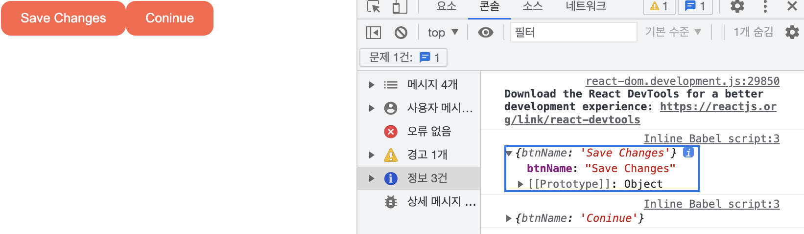
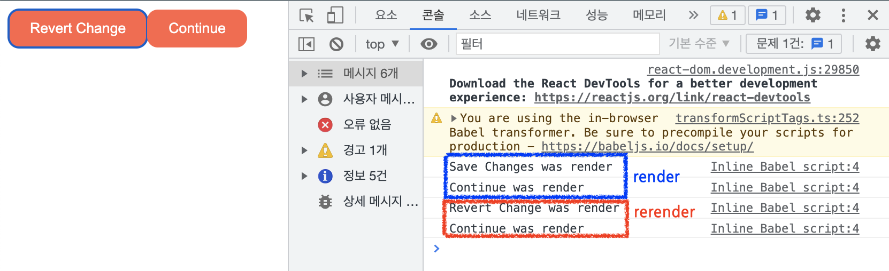
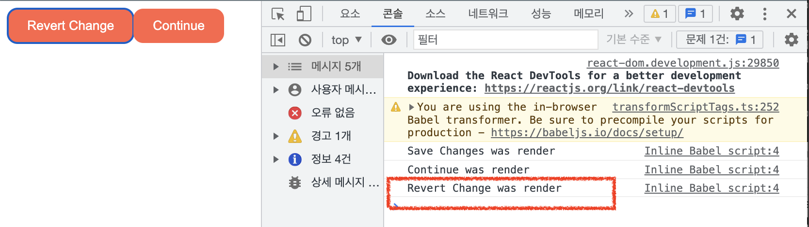
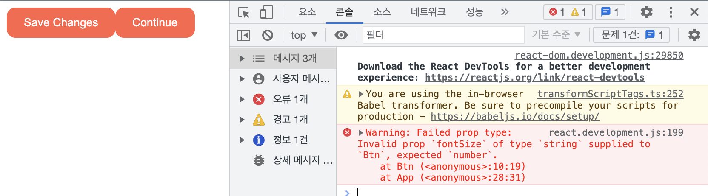

# The Basic of React
> 노마드코더 React Basic 강의

## 1. Props
화면을 컴포넌트 단위로 설계할때 부모 컴포넌트와 자식컴포넌트는 어떻게 데이터를 주고 받을까? 

### 1-1) Props
Props는 일종의 부모-자식 컴포넌트 사이에서 데이터를 주고받는 방식이다. Props는 컴포넌트를 재사용하기 위해서 사용된다. 아래코드를 살펴보자!

```javascript
function Btn(props) {
  console.log(props)

  return <button style={{
    backgroundColor: "tomato",
    color: "white",
    padding: "10px 20px",
    border:0,
    borderRadius: 10
  }}>{props.btnName}</button>;
}

function App() {
  return (
    <div>
      <Btn btnName="Save Changes" />
      <Btn btnName="Coninue" />
    </div>
  )
};

const app = document.getElementById("app");
ReactDOM.createRoot(app).render(<App />);
```


ReactJS는 자동으로 태그 내의 모든 프로퍼티들을 모조리 객체로 만들어서  컴포넌트의 첫번째 인자로 전달한다. 즉, `<Btn btnName="Save Changes" />` 코드는 JS상에서 `Btn({btnName: "Save Changes"}`로 호출된다.

또한, props는 아래처럼 함수도 전달할 수 있다.

정리하면 컴포넌트에는 HTML Element처럼 속성을 지정해줄 수 없으며, 컴포넌트에 위 행위를 하는 것은 그저 props를 전달해 주는 것이다.(Prop 은 component 에 보내지는 argument이다.)


```javascript
function Btn({btnText, onClick}) {
  
  console.log(btnText, "was render");

  return <button
    onClick={onClick} // Click 이벤트는 이렇게 설정!
    style={{
      backgroundColor: "tomato",
      color: "white",
      padding: "10px 20px",
      border: 0,
      borderRadius: 10,
    }}>{btnText}</button>;
}

function App() {
  const [value, setValue] = React.useState("Save Changes");
  const changeValue = () => setValue("Revert Change");
  return (
    <div>
      {/* 컴포넌트 상의 onClick은 prop이며, 함수이다!(event가 아님!) */}
      <Btn btnText={value} onClick={changeValue} />
      <Btn btnText="Continue" />
    </div>
  )
};
```
위 코드에서 첫번째 Btn을 클릭하면 `setState`함수가 실행되고 리엑트는 rerender를 진행하는데, 두번째 Btn도 rerender가 될까..? 답은 된다! 부모 컴포넌트가 state(상태)변화를 겪으면(이 상태변화가 하위 컴포넌트에서 일어나도) 하위 컴포넌트는 rerender 된다.



그런데, 위 로그를 보고 있으면 두번째 Btn(continue)은 굳이 rerender를 할 필요가 없어보인다. 때문에 React에서는 이 rerender에 대한 옵션을 제공한다. **컴포넌트 Props의 변경이 없을때, 해당 컴포넌트를 rerender하지 않는 방법인 `React memo`를 알아보자!**

### 1-2) memo
`React.memo()`를 이용하여, Props의 변경이 있을때만 해당 컴포너트를 rerender하도록 코드를 변경해보자!

```javascript
function Btn({btnText, onClick}) {
  console.log(btnText, "was render");
  return <button
    onClick={onClick}
    style={{
      backgroundColor: "tomato",
      color: "white",
      padding: "10px 20px",
      border: 0,
      borderRadius: 10,
    }}>{btnText}</button>;
}
// MemorizedBtn은 memorizes version의 Btn 컴포넌트가 된다!
const MemorizedBtn = React.memo(Btn);

function App() {
  const [value, setValue] = React.useState("Save Changes");
  const changeValue = () => setValue("Revert Change");
  return (
    <div>
      <MemorizedBtn btnText={value} onClick={changeValue} />
      <MemorizedBtn btnText="Continue" />
    </div>
  )
};

const app = document.getElementById("app");
ReactDOM.createRoot(app).render(<App />);
```


부모 컴포넌트의 state가 변경된다고 모든 자식 컴포넌트가 다시 그려지는 건 대규모 어플리케이션에서 성능 저하를 일으키는 원인이 될 수 있다.


### 1-3) PropTypes
[📌 PropTypes Docs](https://ko.reactjs.org/docs/typechecking-with-proptypes.html)

`PropTypes`이란 어떤 타입의 prop을 받고 있는지 체크할 때 사용하는 라이브러리이다.

```javascript
function Btn({text, fontSize}) {
  return <button
    style={{
      fontSize,
    }}>{text}</button>;
}

function App() {
  return (
    <div>
      <Btn text="Continue" fontSize={"hi"}/>
    </div>
  )
};
```
위와 같이 fontSize에는 숫자가 들어가야할 것 같은데 ReactJS는 이를 알 수 없다. 왜냐면 위 코드가 문법적으로는 문제가 없기때문이다.
이럴때 PropTypes를 사용하면 ReactJS에게 어떤 타입의 변수가 들어올 것인지를 알릴 수 있게되어, 원치 않는 에러를 방지할 수 있다.

```html
<!DOCTYPE html>
<html lang="en">

<head>
  <meta charset="UTF-8">
  <meta http-equiv="X-UA-Compatible" content="IE=edge">
  <meta name="viewport" content="width=device-width, initial-scale=1.0">
  <title>Document</title>
</head>

<body>
  <div id="app"></div>
</body>
<script crossorigin src="https://unpkg.com/react@18/umd/react.development.js"></script>
<script crossorigin src="https://unpkg.com/react-dom@18/umd/react-dom.development.js"></script>
<script src="https://unpkg.com/@babel/standalone/babel.min.js"></script>
<!-- prop-types -->
<script src="https://unpkg.com/prop-types@15.6/prop-types.js"></script>
<script type="text/babel">

  function Btn({text, fontSize}) {
    return <button
      style={{
        fontSize,
        backgroundColor: "tomato",
        color: "white",
        padding: "10px 20px",
        border: 0,
        borderRadius: 10,
      }}>{text}</button>;
  }
  
  // PropTypes를 이용한 Type 지정!
  Btn.propTypes = {
    text: PropTypes.string,
    fontSize: PropTypes.number
  }

  function App() {
    const [value, setValue] = React.useState("Save Changes");
    const changeValue = () => setValue("Revert Change");
    return (
      <div>
        <Btn text={value} fontSize={18} />
        <Btn text="Continue" />
      </div>
    )
  };
  const app = document.getElementById("app");
  ReactDOM.createRoot(app).render(<App />);

</script>

</html>
```

PropTypes으로 지정한 타입이 아닌 다른 타입이 들어오면 console창에 경고를 띄우는 걸 확인할 수 있다.


물론 경고창을 띄우는 것이 아니라 강제로 데이터 타입을 강제하는 방법도 존재한다. 이건 Document를 참고하자!