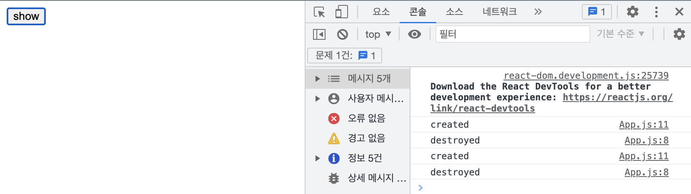

# The Basic of React
> 노마드코더 React Basic 강의

## 1. Effect
```javascript
import React from 'react';
import {useState} from 'react';

function App() {
  const [counter, setCounter] = useState(0);
  const onClick = () => setCounter(prev => prev+1);
  // counter변경 때마다 콘솔에 출력된다.
  console.log('render');
  return (
    <div>
      <h1>{counter}</h1>
      <button onClick={onClick}>Click me</button>
    </div>
  );
}
```
위 코드에서 console.log는 state가 변화할때마다(버튼이 눌릴때마다) 실행된다. **잘 생각해보면 render가 될때마다 실행되면 안되는 코드가 있을 수 있다.** 예를 들면 API로 초기데이터를 가져오는 함수가 있을 것이다. 이 함수는 컴포넌트가 처음 렌더링될때만 실행되야하고 state가 변경돼도 재실행되면 안된다. 이런 건 어떻게 구현 수 있을까...?


### 1-1) useEffect 
`useEffect`함수는 해당 코드를 딱 한번만 실행할 수 있도록 보호하는 역할을 한다. 

```javascript
import React from 'react';
import {useState, useEffect} from 'react';

function App() {
  const [counter, setCounter] = useState(0);
  const onClick = () => setCounter(prev => prev+1);
  console.log('i run all the time');

  // iRunOnlyONce는 딱 한번만 호출된다!
  const iRunOnlyONce = () => {
    console.log('i run only once!');
  }
  useEffect(iRunOnlyONce, []);

  return (
    <div>
      <h1>{counter}</h1>
      <button onClick={onClick}>Click me</button>
    </div>
  );
}
```


아래코드의 console.log가 언제 찍힐지 예상해보자!

```javascript
function App() {
  const [counter, setCounter] = useState(0);
  const [keyword, setKeyword] = useState("");
  const onClick = () => setCounter(prev => prev + 1);
  const onChange = (event) => setKeyword(event.target.value);
  // [1] counter, keyword가 변경될 때마다 실행됨
  console.log('i run all the time');

  useEffect(() => {
    // [2] useEffect가 감시하는 게 없음. 맨 처음 렌더시에만 실행됨
    console.log('i run only once!');
  }, [])

  useEffect(()=>{
    // [3] keyword가 변경될때마다 실행된다.
    console.log('saerch for',keyword);
  }, [keyword]);

  return (
    <div>
      <input
        value={keyword}
        onChange={onChange}
        type='text'
        placeholder='Search here!'></input>
      <h1>{counter}</h1>
      <button onClick={onClick}>Click me</button>
    </div>
  );
}
```

react는 state가 변화될때 component를 재실행한다. UI 관점에서 새로운 데이터가 들어올때마다 자동으로 새로고침되는 것은 분명 좋은 기능이지만, api 호출 및 초기데이터 호출과 같은 작업에 있어서는 좋은 성능을 내지 못하며 비효율 적이다. 즉, `useEffect`는 우리가 언제 해당 코드를 실행할 지에 대한 선택권을 가지게 해준다.


### 1-2) useEffect 활용
```javascript
function Hello() {
  const createdFn = () => console.log("created");
  // useEffect가 감시하는 state가 없음. 즉, Hello컴포넌트가 처음 렌더링 될때만 실행됨!
  useEffect(createdFn, []);
  return <h1>Hello</h1>
}

function App() {
  const [showing, setShowing] = useState(false);
  const onClick = () => setShowing(prev => !prev);

  return (
    <div>
      {showing ? <Hello /> : null}
      <button onClick={onClick}>{showing ? "hide" : "show"}</button>
    </div>
  );
}
```

위 코드를 보면 show버튼을 누를 때마다 Hello컴포넌트가 새로 만들어지는 걸 확인 할 수 있다.(useEffect로 찍은 로그가 show 버튼이 눌릴 때마다 실행) 즉, react는 해당 컴포넌트를 지웠다가 다시 생성한다. 


그렇다면 좀 더 복잡한 앱을 구현할 때, show를 누를때마다 새로 갱신되는 게 아닌 이전 Hello컴포넌트를 그대로 가져올 수 있을까...? 컴포넌트가 destoryed될때를 알 수 있다면, 그 시점에 state 정보를 저장할 수 있을 것이다.

useEffect에서 destoryed될때 실행할 함수를 반환하도록 하자!

```javascript
function Hello() {
  const destroyedFn = () =>{
    console.log("destroyed");
  }
  const createdFn = () => {
    console.log("created");
    return destroyedFn;
  }
  useEffect(createdFn, []);
  /*
  // 보통은 아래처럼 익명함수를 사용하지만 설명을 위해 위에처럼 풀어서 작성함!
  useEffect(() => {
    console.log("created");
    return console.log("destroyed");
  }, []);
  */
  return <h1>Hello</h1>
}

function App() {
  const [showing, setShowing] = useState(false);
  const onClick = () => setShowing(prev => !prev);

  return (
    <div>
      {showing ? <Hello /> : null}
      <button onClick={onClick}>{showing ? "hide" : "show"}</button>
    </div>
  );
}
```


**⭐️ `useEffect`함수는 언제 코드를 실행할 지 선택권을 준다.**

(1)컴포넌트의 첫 랜더링 시에만 실행 
(2)특정 state가 변경될때만 실행
(3)해당 컴포넌트가 파괴될때 실행


