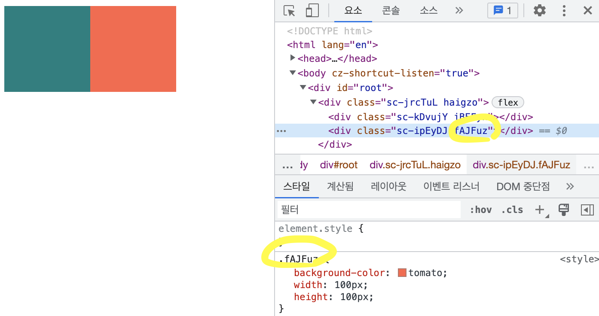
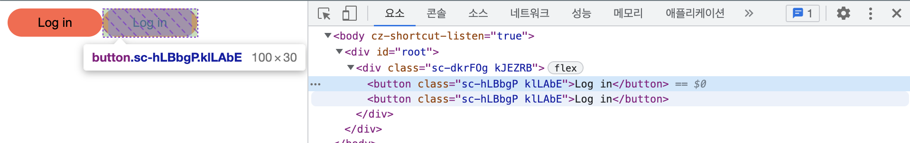
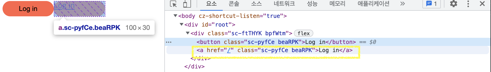
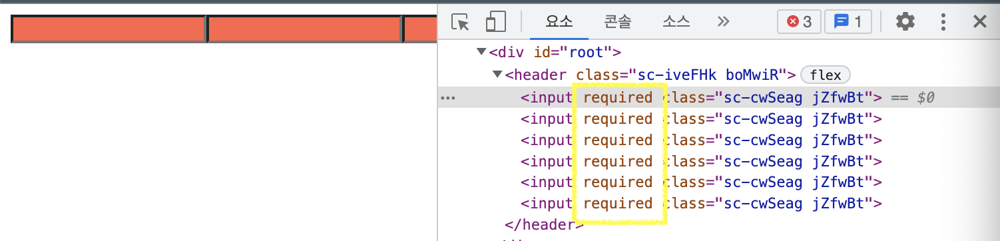

# The Basic of React
> 노마드코더 React master 강의

> [styled-components Docs](https://styled-components.com)


이전까지 style을 사용하기 위해서 아래 방법들을 사용했었다.
```javascript
import React from 'react';
import ReactDOM from 'react-dom/client';
// [1]css파일 자체를 import하여 컴포넌트 전체에 해당 css가 적용되도록 함
import './index.css';
import App from './App';

const root = ReactDOM.createRoot(document.getElementById('root'));
root.render(
  <App />
);
```

```javascript
function App() {
  return (
    // [2]직접 스타일 속성을 나열하는 방법
    <div style={{display: "flex"}}>
      <div style={{backgroundColor: "teal", width:100, height:100}}></div>
      <div style={{backgroundColor: "tomato", width:100, height:100}}></div>
    </div>
  );
}

export default App;
```
이외에 직접 class를 넣어주는 방법 등 여러 방법이 존재하지만 과연 이것이 최선일까...?

## styled-components💎
styled-components를 설치하자!

```shell
npm install --save styled-components
```

### styled-components 사용하기

이전에 작성했던 App컴포넌트를 `styled-components`를 사용하도록 해보자!

```javascript
import styled from "styled-components";

const Father = styled.div`
  display: flex;
`;

const Box01 = styled.div`
  background-color: teal;
  width: 100px;
  height: 100px;
`;

const Box02 = styled.div`
  background-color: tomato;
  width: 100px;
  height: 100px;
`;

function App() {
  return (
    <Father>
      <Box01 />
      <Box02 />
    </Father>
  );
}

export default App;
```
보는 것처럼 **태그에 직접 스타일을 넣어줄 필요가 없고 기존 css문법 그대로 사용이 가능하다. 또한 재사용도 가능**하다!@_@!! 

태그 상에 스타일이나 클래스명을 지정하지 않아도 된다. 웹에서 찍어보면 `styled-components`는 임의의 클래스명을 만들어서 element를 그려주고 있는 것으로 보인다.



### Adapting and Extending

이전에 작성한 코드를 보면 `Box01`, `Box02`는 배경색만 빼고 동일한 스타일 속성을 가지고 있는데, 이를 꼭 따로 정의해야할까? 공통인 부분은 따로 뺼 수 있는 방법이 없을까?

`Props`를 이용해보자!

```javascript
import styled from "styled-components";

const Father = styled.div`
  display: flex;
`;

const Box = styled.div`
  background-color: ${props => props.bgColor};
  width: 100px;
  height: 100px;
`;

function App() {
  return (
    <Father>
      <Box bgColor="teal"/>
      <Box bgColor="tomato"/>
    </Father>
  );
}

export default App;
```

아래 스타일 속성들은 크기, 배경색 등 스타일이 같은데, border-radius 떄문에 따로 Circle을 정의하고 있다.

```javascript
const Box = styled.div`
  background-color: ${props => props.bgColor};
  width: 100px;
  height: 100px;
`;

const Circle = styled.div`
  background-color: ${props => props.bgColor};
  width: 100px;
  height: 100px;
  border-radius: 50%;
`;
```

styled-components는 `상속(확장)`을 지원한다.

```javascript
const Box = styled.div`
  background-color: ${props => props.bgColor};
  width: 100px;
  height: 100px;
`;

const Circle = styled(Box)`
  border-radius: 50%;
`;
```

### `as`

컴포넌트의 태그를 바꾸고 싶은데, 스타일은 바꾸고 싶지 않을땐 어떻게 styled-components를 활용할 수 있을까?

즉, 아래 코드의 style.`button` 태그를 변경하지만 내부에 정의한 스타일을 그대로 사용하는 또 다른 태그를 만드려면 어떻게 해야할끼?

```javascript
import styled from "styled-components";

const Father = styled.div`
  display: flex;
`;

const Btn = styled.button`
  background-color: tomato;
  width: 100px;
  height: 30px;
  border-radius: 15px;
  border:0px;
`;

function App() {
  return (
    <Father>
      <Btn>Log in</Btn>
      <Btn>Log in</Btn>
    </Father>
  );
}

export default App;
```


이럴때는 `as`를 props로 전달하여 태그를 바꿔줄 수 있다.

```javascript
import styled from "styled-components";

const Father = styled.div`
  display: flex;
`;

const Btn = styled.button`
  background-color: tomato;
  width: 100px;
  height: 30px;
  border-radius: 15px;
  border:0px;
`;

function App() {
  return (
    <Father>
      <Btn>Log in</Btn>
      {/* as에 바꾸고 싶은 태그 이름을 전달해준다! */}
      <Btn as="a" href="/">Log in</Btn>
    </Father>
  );
}

export default App;
```


뭔가 새로운 기능을 추가할 계획이 없고 컴포넌트를 확장하고 싶지 않을 때, `as`는 유용하게 사용가능하다!

또한, 당연하거지만 style 태그 내에 html 태그 속성도 사용가능하다.
`<Btn as="a" href="/">`


### attrs
특정 속성이 반복되는 태그들을 더 효율적으로 작성하는 방법이 없을까?

```javascript
const Input = styled.input`
  background-color: tomato;
`
function App() {
  return (
    <Father as="header">
      <Input required />
      <Input required />
      <Input required />
      <Input required />
      <Input required />
      <Input required />
    </Father>
  );
}
```

`attrs`를 활용해보자!

```javascript
const Input = styled.input.attrs({required: true})`
  background-color: tomato;
`
function App() {
  return (
    <Father as="header">
      <Input />
      <Input />
      <Input />
      <Input />
      <Input />
      <Input />
    </Father>
  );
}
```




### Animations and Pseudo Selectors
styled-components는 sass처럼 스타일 속성을 지정할 수 있게 해준다.👍
진짜 미쳤다....

```javascript
import styled, { keyframes } from "styled-components";

const Wrapper = styled.div`
  display: flex;
`;

const rotateAnimation = keyframes`
  /* 일반 css처럼 애니메이션 keyframes를 정의할 수 있다.  */
  0% {
    transform: rotate(0deg);
    border-radius: 0px;
  }50%{
    border-radius: 100px;
  }100% {
    transform: rotate(360deg);
    border-radius: 0px;
  }
`;

const Box = styled.div`
  display: felx;
  justify-content: center;
  align-items: center;
  height:100px;
  width:100px;
  background-color: tomato;
  animation: ${rotateAnimation} 1s linear infinite;
  /* sass처럼 하위태그 사용 가능 */
  span {
    font-size: 20px;
    &:hover{
      font-size: 40px;
    }
  }
`;

function App() {
  return (
    <Wrapper>
      <Box>
        <span>🙄</span>
      </Box>
    </Wrapper>
  );
}

export default App;
```


### Pseudo Selectors2
이전코드의 span은 styled-components를 사용하지 않은 것으로 p태그로 변경하면 hover 스타일이 적용이 되지 않는 문제가 있다.

```javascript
const Emoji = styled.span`
  font-size: 20px;
`;

const Box = styled.div`
  display: felx;
  justify-content: center;
  align-items: center;
  height:100px;
  width:100px;
  background-color: tomato;
  animation: ${rotateAnimation} 1s linear infinite;

  /* 이렇게 태그자체를 가져와서 사용할 수 있다. */
  ${Emoji} {
    &:hover{
      font-size: 40px;
    }
  }
`;

function App() {
  return (
    <Wrapper>
      <Box>
        {/* p태그로 렌더링! */}
        <Emoji as="p">😎</Emoji>
      </Box>
    </Wrapper>
  );
```
styled-components는 자체 타겟팅을 지원한다. 즉, html태그가 바뀌어도 지정된 스타일을 적용할 대상 태그를 타켓팅할 수 있게된다.


### Themes
`theme`이란 모든 색상을 가지고 있는 object이다. `theme`를 잘 활용하면 다크모드 등을 쉽게 구현할 수 있다.

모든 색을 하나의 object안에 넣어뒀기 때문에 유용하다. 컴포넌트의 색을 바꿔준다고 할때 그에 해당하는 object만 바꿔주면 되기 때문이다.


```javascript
// index.js
import React from 'react';
import ReactDOM from 'react-dom/client';
import App from './App';
import { ThemeProvider } from 'styled-components';

const darkTheme = {
  textColor:"whitesmoke",
  backgroundColor:"#111"
}

const lightTheme = {
  textColor:"#111",
  backgroundColor:"whitesmoke"
}

const root = ReactDOM.createRoot(document.getElementById('root'));
root.render(
  <ThemeProvider theme={darkTheme}>
    <App />
  </ThemeProvider>
);
```

`ThemeProvider`는 theme이라는 props를 받는다.
`ThemeProvider`를 import 했다면 이제 그 아래 App 컴포넌트 아래 모든 컴포넌트에서 theme으로 넘겨준 객체(색)에 접근할 수 있게 됐다.

```javascript
// App.js
import styled, { keyframes } from "styled-components";

const Wrapper = styled.div`
  display: flex;
  height: 100vh;
  width:100vw;
  justify-content: center;
  align-items: center;
  /* theme에 접근이 가능하다. */
  background-color: ${(props)=>props.theme.backgroundColor};
`;

const Title = styled.h1`
  color: ${(props)=>props.theme.textColor};
`;

function App() {
  return (
    <Wrapper>
      <Title>HELLO</Title>
    </Wrapper>
  );
}

export default App;
```

index.js에서 ThemeProvider로 전달하는 theme을 lightMode로 바꾸면 색상이 한번에 바뀐다. 이는 다크모드를 구현하는데 활용된다.
