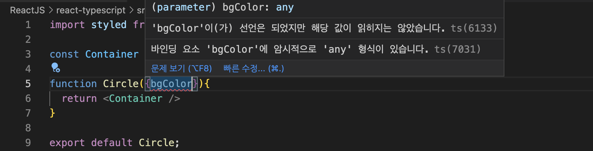

# The Basic of React
> 노마드코더 React master 강의

> Typesctipt 맛보기라고 생각하자. 이번에는 Typescript + ReactJS + styled-compoment를 함께 사용했을 때, 얼마나 생산적이고 실수가 줄어들 수 있는지 확인해보자!

## Typescript
`typescript`는 javascript를 기반으로 한 프로그래밍 언어이다.
- strongly-typed : 프로그래밍 언어가 작동하기 전에 type을 확인한다.

### Typescript가 필요한 이유
```javascript
/* 
자바스크립트는 아래처럼 b에 어떤 타입이 들어가도 정상적으로 동작한다. 그런데 이것은 개발자가 생각하지 못한 다른 문제를 야기할 수 있다. 그러므로 자료형을 고정할 수 있는 typescript를 적용할 필요가 있다.
*/
const plus = (a, b) => a+b;
plus(2,3); //5
plus(2, "hi"); //'2hi'

// user에는 name이 없지만 아래처럼 작성해도 오류가 발생하지 않는다.
const user = {
  firstName: "Angela",
  lastName: "Davis"
}
console.log(user.name); //undefined
```

브라우저가 이해할 수 있는 유일한 프로그래밍 언어는 javascript이다.
즉, Typescript는 브라우저가 이해하지 못한다. 따라서 개발자가 작성한 코드를 컴파일할때 typescript는 평범한 javascript로 변환된다.

`strongly-typed`라는 특징처럼 **typescript로 작성된 코드는 컴파일 되기 전에 type을 확인하고 이상이 없으면 평범한 javascript 코드로 리턴되어 브라우저에서 동작이 가능**하도록 한다.


### Typescript 시작하기

```shell
npx create-react-app {앱이름} --template typescript
```
typescript의 확장자는 .js가 아니라 `.txs`이다.

> **`npm install --save styled-components`로 styled-components를 추가하면 에러가 나는 이유**
> styled-components는 javascript로 만들어져있다. typescript는 javascript를 이해하지 못하므로 빌드할 때 에러가 발생한다. 
> 따라서 typescript가 이해할 수 있는 패키지를 설치해야한다.
>```shell
>npm i --save-dev @types/styled-components
>```

### type definition: @types
@types/styled-components의 `@types`는 [github 레포지토리](https://github.com/DefinitelyTyped/DefinitelyTyped/tree/master/types)인데, 말하자면 유명한 npm 라이브러리들의 type definition을 알려주는 저장소를 지칭한다.

여러 개발자들이 javacript라이브러리를 typescript에서 사용이 가능하도록 type definition을 만들어 둔것이다.

물론 이 레포에서 찾을 수 없는 라이브러리들도 있다. 그때는 기쁜 마음으로 type definition을 작성해보는 것도 좋은 경험이 될 것이다!


### Typing the Props
typescript에게 react component의 prop를 어떻게 설명할까? 즉, component가 필요로 하는 prop들의 type을 어떻게 지정해야할까?(이전에 [Props Types](./02_Props.md#1-3-proptypes)로 컴포넌트 props들의 타입을 지정하는 걸 배운적이 있는데, 그건 javascript였다. 즉, 코드가 실행된 후에만 동작하는 것으로 우리가 여기서 하려는 'javascript 코드 실행 전'에 검사하는 방법으로는 적당하지 않다.)

아래처럼 작성하면 component의 prop type을 모른다고 오류가 나고 있다.
```javascript
import styled from 'styled-components';

const Container = styled.div``;

function Circle({bgColor}){
  return <Container />
}

export default Circle;
```


`interface`를 사용해보자! `interface`란 object shape을 typescript에게 설명해주는 것이다.

```typescript
import styled from 'styled-components';

// [2]Container의 props 타입을 지정하는 방법
interface ContainerProps {
  bgColor: string;
};

const Container = styled.div<ContainerProps>`
  width: 200px;
  height: 200px;
  background-color: ${props => props.bgColor};
`;

interface  CircleProps {
  bgColor: string;
}

// [1]Circle의 props 타입은 CircleProps이라고 알려주는 것!
function Circle({bgColor}: CircleProps){
  return <Container bgColor={bgColor}/>
}

export default Circle;
```

정리하자면 `interface`는 object의 형태를 정의한다.
```typescript
interface PlayerShape{
  name:string; 
  age:number
};

const sayHello = (playerObj: PlayerShape) => `Hello ${playerObj.name}, you are ${playerObj.age} years old!`;

sayHello({name:"nana", age:12});
sayHello({name:"nana", age:12, hello: 1}); //오류!
````

