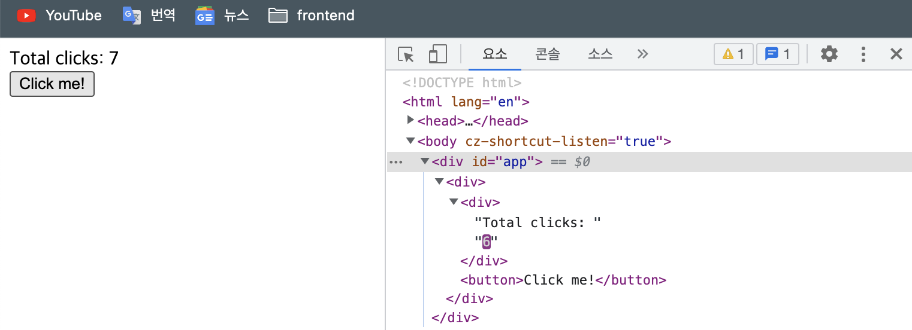

# The Basic of React
> 노마드코더 React 강의 참고

## 1.why React?

클릭버튼을 누르면 화면에 클릭수가 표시되는 기능을 vaniila로 작성해보자.
```html
<!DOCTYPE html>
<html lang="en">
<head>
  <meta charset="UTF-8">
  <meta http-equiv="X-UA-Compatible" content="IE=edge">
  <meta name="viewport" content="width=device-width, initial-scale=1.0">
  <title>Document</title>
</head>
<body>
  <span>Total clicks: 0</span>
  <button id="btn" >Click me!</button>
</body>
<script>
  let counter = 0;
  const button = document.getElementById('btn');
  const span = document.querySelector('span');
  function handleClick() {
    counter += 1;
    span.innerText = `Total clicks: ${counter}`;
  }
  button.addEventListener('click', handleClick);
</script>
</html>
```
위 코드를 만들기까지 많은 작업이 필요하다.
(1)HTML 객체를 생성한다. 
(2)Javascript에서 해당 객체를 가져온다.
(3)click이벤트를 감지하고
(4)화면과 데이터를 갱신한다.
화면에서 특정 기능을 구현하기 위해서 매번 (1)~(4)를 반복하지 않을 방법이 없을까?

### React를 활용해서 위 코드를 바꿔보자!
`react`는 html객체를 생성하는 일종의 엔진역할을 하는 라이브러리이고 `react-dom`은 react로 생성된 element를 실제 화면상(html)에 뿌려주는 역할을 한다.

```html
<!DOCTYPE html>
<html lang="en">

<head>
  <meta charset="UTF-8">
  <meta http-equiv="X-UA-Compatible" content="IE=edge">
  <meta name="viewport" content="width=device-width, initial-scale=1.0">
  <title>Document</title>
</head>
<body>
  <div id="app"></div>
</body>
<script crossorigin src="https://unpkg.com/react@18/umd/react.development.js"></script>
<script crossorigin src="https://unpkg.com/react-dom@18/umd/react-dom.development.js"></script>
<script>
  const app = document.getElementById("app");
  const span = React.createElement("span",
    {
      id: "s-span",
      onMouseEnter: () => console.log("mouse enter"),
    },
    "hello I'm span");

  const btn = React.createElement(
    "button",
    {
      style: { backgroundColor: "tomato" },
      onClick: () => console.log('hi'),
    },
    "Click me!");
  const container = React.createElement("div", null, [span, btn]);
  ReactDOM.createRoot(app).render(container);
</script>
</html>
```
- vanilla에서는 html을 먼저 만들고 javascript로 해당 객체를 가져와서 html을 갱신하는 순서로 작업이 이뤄진다.(html -> javascript)
- 반면, react의 경우 위 코드처럼 react javascript 자체에서 객체를 만든 뒤에 html을 만들어 뿌려준다. 즉, react에서 element를 잡고 있기때문에 업데이트가 필요한 시점에 react가 해당 객체만 업데이트 할 수 있다는 것을 의미한다.(React: javascript -> html)


### 더 쉬운 방법 사용하기: JSX와 Babel
> `JSX`를 사용하면 기존에 사용하던 html문법으로 객체를 생성할 수 있다. 그러나 이것을 React가 이해할 수 있는 코드로 변환하기 위해서는 `Babel`의 도움이 필요하다!
> 
> **JSX**
> ```html
>  const btn = React.createElement(
>    "button",
>    {
>      style: { backgroundColor: "tomato" },
>      onClick: () => console.log('hi'),
>    },
>    "Click me!");
>```
> **React**
> ```html
>  const btn = React.createElement(
>    "button",
>    {
>      style: { backgroundColor: "tomato" },
>      onClick: () => console.log('hi'),
>    },
>    "Click me!");
>```

```html
<body>
  <div id="app"></div>
</body>
<script crossorigin src="https://unpkg.com/react@18/umd/react.development.js"></script>
<script crossorigin src="https://unpkg.com/react-dom@18/umd/react-dom.development.js"></script>
<!-- Load Babel -->
<script src="https://unpkg.com/@babel/standalone/babel.min.js"></script>
<script type="text/babel" >
  // JSX를 이용한 element 생성!
  const Title = (
    <h3 id="title" onMouseEnter={() => console.log("mouse enter")}>Title</h3>
  );
  const Button = (
    <button
      style={{ backgroundColor: "tomato" }}
      onClick={() => console.log("I'm click!")}
    >"Click me!"
    </button>
  );

  const container = React.createElement("div", null, [Title, Button]);

  const app = document.getElementById("app");
  ReactDOM.createRoot(app).render(container);
</script>
```

위 코드를 더 간결하게 태그형식으로 바꿔보자! 

```html
<script type="text/babel" >
  // 즉시실행함수로 JSX를 반환
  const Title = () => (
    <h3 id="title" onMouseEnter={() => console.log("mouse enter")}>Title</h3>
  );
  // 즉시실행함수로 JSX를 반환
  const Button = () => (
    <button
      style={{ backgroundColor: "tomato" }}
      onClick={() => console.log("I'm click!")}
    >"Click me!"
    </button>
  );
  // JSX를 이용해 객체를 생성하려면 첫글자는 대문자로 시작하는게 좋다. 소문자로 시작하는 경우, <button/>이 일반 html태그인지 JSX객체인지 파악이 어렵다.
  const Container = (
    <div>
      <Title/>
      <Button/>
    </div>
    );

  const app = document.getElementById("app");
  ReactDOM.createRoot(app).render(Container);

/* //Container를 즉시실생함수로 변경하면 render할때 태그형식으로 사용이 가능하다!
  const Container = () => (
    <div>
      <Title/>
      <Button/>
    </div>
    );

  const app = document.getElementById("app");
  ReactDOM.createRoot(app).render(<Container/>);

*/
</script>
```
`React`, `JSX`, `Babel`을 이용하여 html element를 생성하고 이벤트를 추가했는데, counter값 변경은 어떻게 구현해줘야 할까? vanilla처럼 각 객체에 설정된 이벤트에 동작 함수를 걸어야 하는 걸까? React State를 공부해보자!

## 2. Understanding React State!⭐️

counter변수를 추가한 모습이다. 이 코드를 화면에서 돌려보면 counter변수 값은 증가하는데, 화면 갱신이 일어나지 않는다.

```html
<body>
  <div id="app"></div>
</body>
<script type="text/babel">
  let counter = 0;
  function countUp(){
    counter = counter+1;
  }
  const Container = () => (
    <div>
      <span>Total clicks: {counter}</span>
      <button onClick={countUp}>Click me!</button>
    </div>
  );

  const app = document.getElementById("app");
  ReactDOM.createRoot(app).render(<Container />);

</script>
```
보는 것처럼 이 코드는 Container를 한번만 렌더링하고 리렌더링을 하는 부분이 없다. 그렇다면 countUp함수가 호출될때마다 Counter를 렌더링하려면 어떻게 해야될까?

```javascript
let counter = 0;
function countUp(){
  counter = counter+1;
  // 간단하게 counterUp함수가 호출될때마다 렌더링 시키기!
  ReactDOM.createRoot(app).render(<Container />);
}
const Container = () => (
  <div>
    <span>Total clicks: {counter}</span>
    <button onClick={countUp}>Click me!</button>
  </div>
);

const app = document.getElementById("app");
ReactDOM.createRoot(app).render(<Container />);
```
함수가 늘어날수록 위 코드는 비효율적이다! reRender함수를 만들어보자!

```javascript
const app = document.getElementById("app");
let counter = 0;

function countUp(){
  counter = counter+1;
  render();
}

// render 함수 추가!
function render(){
  ReactDOM.createRoot(app).render(<Container />);
}

const Container = () => (
  <div>
    <span>Total clicks: {counter}</span>
    <button onClick={countUp}>Click me!</button>
  </div>
);

render();
```
> react를 이용한 렌더링은 vanilla와 비교해서 어떤점이 좋을까? countUp함수가 호출되면 Container 전체가 리렌더링 될거 같지만, 변화가 필요한 부분인 counter변수만 갱신이 일어나는 걸 확인할 수 있다. 이게 바로 react의 강점이다!
> 

사실 react에서는 이것보다 더 좋은 렌더링 방법이 존재한다.

### 2-1) setState : `useState`, react hook api

> `useState` : 상태 유지 값과 그 값을 갱신하는 함수를 반환한다.
> ```javascript
> const [상태값, 상태값을_갱신할_함수] = useState(초기값);
> 상태값을_갱신할_함수(갱신할_상태값);
> ```

```javascript
function App() {
  // 초기 counter상태값을 0으로 등록하고 갱신시, setCounter 함수를 사용한다.
  const [counter, setCounter] = React.useState(0);
  const onClick = () => {
    setCounter(counter+1);
  }
  return (
    <div>
      <div>Total clicks: {counter}</div>
      <button onClick={onClick}>Click me!</button>
    </div>
  )
};

const app = document.getElementById("app");
ReactDOM.createRoot(app).render(<App />);
```